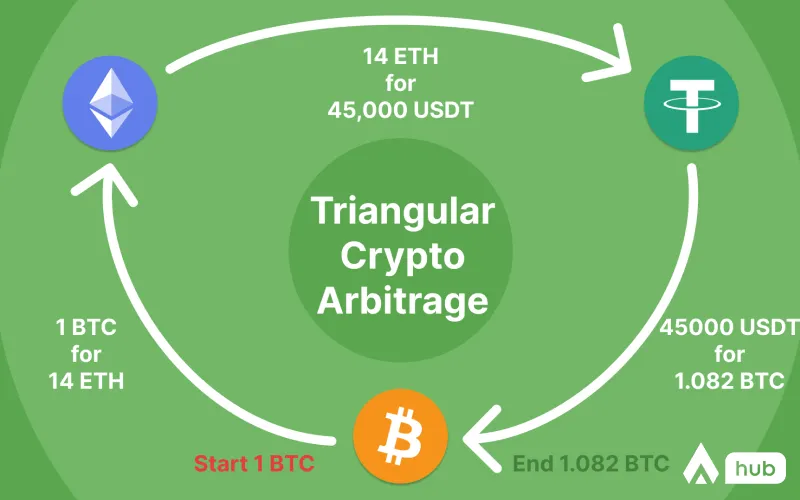

# Cryptocurrency Arbitrage Tracker

### Project Concept

My tool aggregates live price data from the cryptocurrency exchange Gemini in order to check if there are any currently profitable triangular arbitrage opportunities. It utilizes asynchronous Python code to load data and then iterates through the different arbitrage paths to compute the profit, if there is one.

### Application

There are two strategies for executing a triangular arbitrage opportunity, Buy-Buy-Sell or Buy-Sell-Sell. For example, if I utilize a Buy-Buy-Sell strategy I will:
Buy BTC with USD -> Buy ETH with BTC -> Sell ETH for USD

Here is an example output from the tool, utilizing a BBS strategy with the tickers BTC-USD, DOGE-BTC, and DOGE-USD to turn $100 into $100.139. The price is well, the price, and the "size" is the volume of the given currency that is available at the top of the market on a given Ask/Bid.
`1694202527.64:SUCCESS:BBS:100.0->100.139:VOLUME=False:BTCUSD-{'topAskPrice': Decimal('25859.06'), 'topAskSize': Decimal('0.057'), 'topBidPrice': Decimal('25858.63'), 'topBidSize': Decimal('0.05046')},DOGEBTC-{'topAskPrice': Decimal('0.000002441'), 'topAskSize': Decimal('36.49316115'), 'topBidPrice': Decimal('0.00000243'), 'topBidSize': Decimal('59022.55992305')},DOGEUSD-{'topAskPrice': Decimal('0.06324'), 'topAskSize': Decimal('10416.0'), 'topBidPrice': Decimal('0.06321'), 'topBidSize': Decimal('1301.0')}`

These strategies take advantage of market inefficiencies to produce a small profit. This also has the effect of removing the lagging volume, smoothing out the prices relative to each other and (in an optimal scenario) returning the market to equilibrium.

### Further Reading

This graphic helps visually demonstrate how the strategies work. In this case, it starts with BTC and utilizes USDT, otherwise known as Tether, a USD representative. One could even add additional steps to the path, bouncing from cryptocurrency to cryptocurrency until finally returning to USD.

*Source: https://altorise.com/hub/crypto-arbitrage/*

Investopedia has a great article that goes into more detail and is worth a read if you'd like to learn more about this topic, though it is in the context of real, fiat currencies.
https://www.investopedia.com/terms/t/triangulararbitrage.asp

